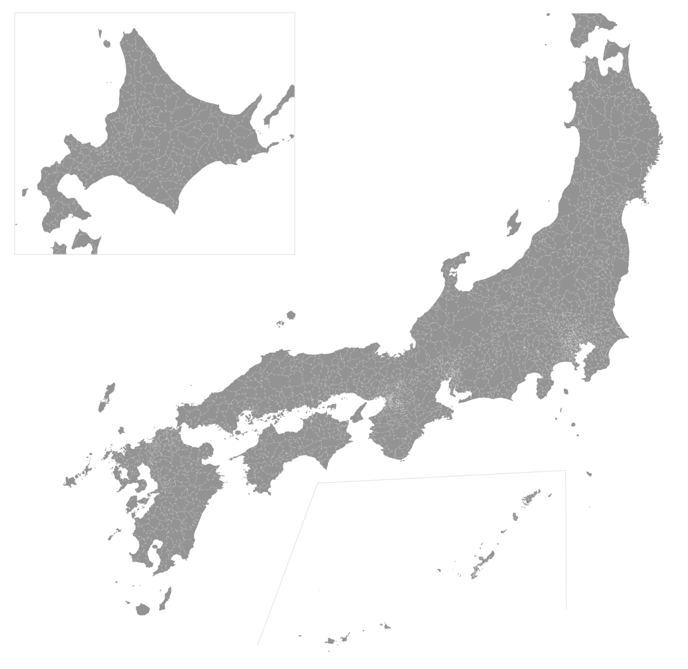

# Japan Atlas TopoJSON

This repository provides a simple script to generate TopoJSON files from [MILT of Japan](http://www.mlit.go.jp/)'s National Land Numerical Information download service.

## Usage

See [jp-atlas-example](https://nobuf.github.io/jp-atlas-example/) and [bl.ocks.org/nobuf](https://bl.ocks.org/nobuf/303d300f57c5c2b6091d2bb01279212a).

## Download

- [japan-2017-topo.json](https://unpkg.com/jp-atlas/jp/japan-2017-topo.json)
- [japan-2017-topo.low.json](https://unpkg.com/jp-atlas/jp/japan-2017-topo.low.json)

## Build

```shell
git clone https://github.com/nobuf/jp-atlas.git
cd jp-atlas

# If you have the latest Docker:
env MLIT_GO_JP_ENDPOINT="http://nlftp.mlit.go.jp/...hidden..." \
	TARGET_YEAR=2017 \
docker-compose up

# Or, if you have nodejs locally:
env MLIT_GO_JP_ENDPOINT="..." \
	TARGET_YEAR=2017 \
npm install
```

It will create JSON files in the `jp` folder.

`TARGET_YEAR` could be `2017`, `2016` etc. Since `MLIT_GO_JP_ENDPOINT` is probably not intended to receive programmatic access, you might want to download them manually. Place the downloaded zip file (ex. `N03-170101_26_GML.zip`) as `tmp/[2 digit prefecture id]_[target year].zip`. You'd need 47 files as Japan has 47 prefectures.

## File Reference

\# **jp/japan-2017-topo.json**

A TopoJSON topology containing one geometry collection: *cities*. The geometry is quantized and simplified.

\# **jp/japan-2017-topo.low.json**

Same as the above file, but for lower zoom level. While it has 1/3 of file size, it is not suitable for city-level zoom.

\# *jp*.objects.**cities**

- `id` — 5 digits code that represents the city/town (市区町村); For instance, `13104` is the code for Shinjuku, Tokyo; See also [list-of-cities-in-japan](https://github.com/nobuf/list-of-cities-in-japan)
- `properties` — currently no property is included





## Contributing

If you have any ideas let us know by opening an issue. Pull requests are warmly welcome.

## License

MIT

## Inspiration

This repository's format is based on [es-atlas](https://github.com/martgnz/es-atlas) and [us-atlas](https://github.com/topojson/us-atlas) :)